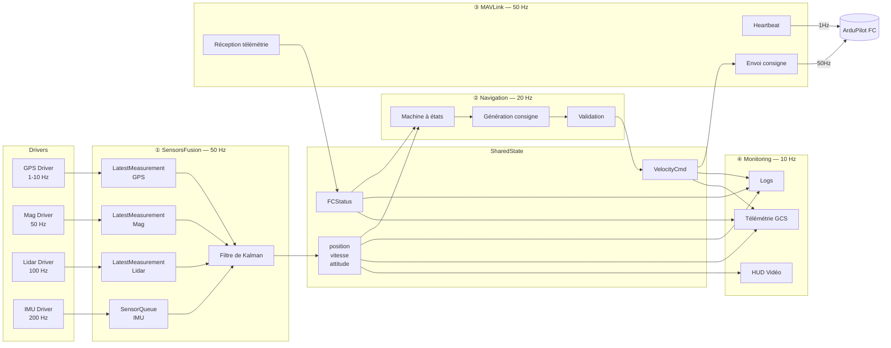
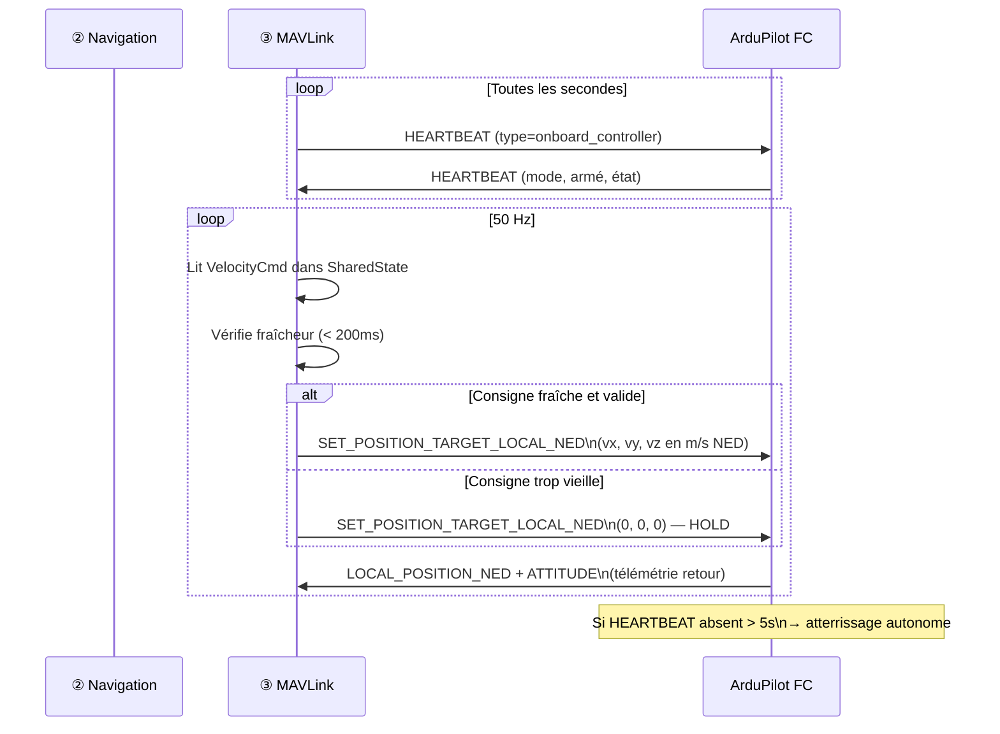
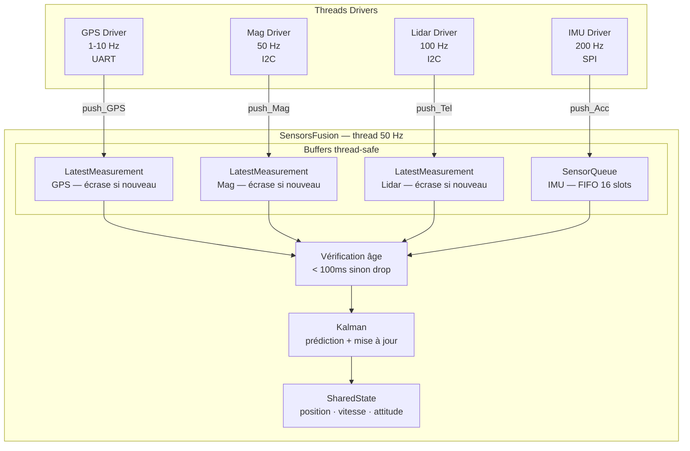
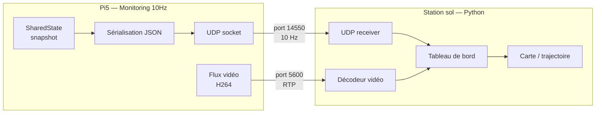
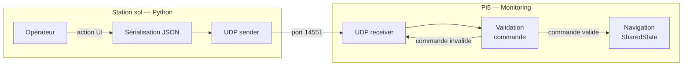

# Software Design Document — Drone Pi5
> Version 0.1 — Vision d'ensemble  
> Auteurs : à compléter  
> Statut : Draft

---

## Table des matières

1. [Vue d'ensemble du système](#1-vue-densemble-du-système)
2. [Flux de données](#2-flux-de-données)
3. Boucles des blocs *(à venir)*
4. Machines à états *(à venir)*
5. Algorigrammes de décision critique *(à venir)*
6. Interface Pi ↔ GCS *(à venir)*

---

## 1. Vue d'ensemble du système

### 1.1 Objectif

Le système pilote un drone autonome en suivant des waypoints.  
Le **Raspberry Pi 5** est le cerveau de la mission : il fusionne les capteurs,
calcule la navigation, et envoie des consignes de vitesse au **Flight Controller
ArduPilot** qui gère le contrôle bas niveau (attitude, moteurs).

En cas de défaillance du Pi, ArduPilot atterrit de façon autonome via son
propre failsafe. Le Pi ne peut pas crasher le drone — il peut seulement le
ralentir ou le faire atterrir.

### 1.2 Contraintes système

| Contrainte | Valeur | Raison |
|---|---|---|
| Fréquence boucle fusion | 50 Hz | Cohérence Kalman |
| Fréquence boucle nav | 20 Hz | Suffisant pour waypoints |
| Fréquence heartbeat FC | 1 Hz minimum | Failsafe ArduPilot |
| Latence max consigne → FC | 200 ms | Au-delà : HOLD automatique |
| Vitesse max horizontale | 5 m/s | Sécurité physique |
| Vitesse max descente | 2 m/s | Sécurité atterrissage |

### 1.3 Architecture globale des systèmes

Les 5 systèmes qui composent la solution, et leurs liens physiques :

```mermaid
graph TB
    subgraph Drone
        subgraph Pi5["Raspberry Pi 5 (Linux RT)"]
            SF[① SensorsFusion]
            NAV[② Navigation]
            MAV[③ MAVLink]
            MON[④ Monitoring]
        end

        subgraph FC["Flight Controller (ArduPilot)"]
            PID[PID Attitude]
            BARO[Baromètre]
            ESC[ESCs / Moteurs]
        end

        subgraph Capteurs
            GPS[GPS]
            MAG[Magnétomètre]
            LIDAR[Télémètre laser]
            IMU[IMU Acc+Gyro]
            CAM[Caméra]
        end
    end

    subgraph Sol
        GCS[Station sol\nPython GCS]
        OP[Opérateur]
    end

    %% Capteurs → Pi
    GPS   -->|UART| SF
    MAG   -->|I2C|  SF
    LIDAR -->|I2C/UART| SF
    IMU   -->|SPI| SF
    CAM   -->|CSI| MON

    %% Pi interne
    SF  -->|SharedState| NAV
    SF  -->|SharedState| MON
    NAV -->|VelocityCmd| MAV
    MAV -->|FCStatus|    NAV
    MAV -->|FCStatus|    MON

    %% Pi → FC
    MAV -->|MAVLink UART| PID
    PID --> ESC
    BARO -->|altitude| PID

    %% Pi → Sol
    MON -->|JSON + vidéo\nWi-Fi UDP| GCS
    GCS -->|commandes\nWi-Fi UDP| MON
    GCS --- OP
```

### 1.4 Responsabilités par système

| Système | Produit | Consomme | Failsafe propre |
|---|---|---|---|
| **① SensorsFusion** | Position, Vitesse, Attitude fusionnées | GPS, Mag, Lidar, IMU | Mode dégradé si capteur mort |
| **② Navigation** | Consignes de vitesse (VelocityCmd) | Position, Vitesse, FCStatus | HOLD si état invalide |
| **③ MAVLink** | FCStatus (baro, armé, mode) | VelocityCmd, heartbeat | HOLD si consigne trop vieille |
| **④ Monitoring** | Logs, télémétrie GCS, HUD vidéo | Tout le SharedState | Non critique |
| **ArduPilot FC** | Contrôle moteurs | Consignes vitesse Pi | Atterrissage si perte heartbeat |
| **GCS Python** | Commandes opérateur, affichage | Télémétrie Pi | Alerte opérateur |

---

## 2. Flux de données

### 2.1 Vue globale des flux internes au Pi

Les 4 blocs communiquent exclusivement via le **SharedState** —
jamais directement entre eux.



### 2.2 Flux Pi → Flight Controller (MAVLink)

Communication série UART entre le Pi et ArduPilot.



### 2.3 Flux capteurs → SensorsFusion

Chaque driver tourne dans son propre thread et pousse ses mesures.



### 2.4 Flux Pi → GCS (télémétrie Wi-Fi)

Ce que le tableau de bord Python reçoit du Pi.



### 2.5 Flux GCS → Pi (commandes opérateur)

Ce que le tableau de bord Python peut envoyer au Pi.



**Commandes disponibles :**

| Commande | Paramètres | Effet |
|---|---|---|
| `ARM` | — | Arme le drone via FC |
| `DISARM` | — | Désarme si au sol |
| `TAKEOFF` | `altitude_m` | Décollage à l'altitude cible |
| `GOTO` | `lat, lon, alt_m` | Aller à un waypoint |
| `HOLD` | — | Maintien de position immédiat |
| `LAND` | — | Atterrissage sur place |
| `RTL` | — | Retour au point de décollage |
| `EMERGENCY` | — | Coupure moteurs (sol uniquement) |